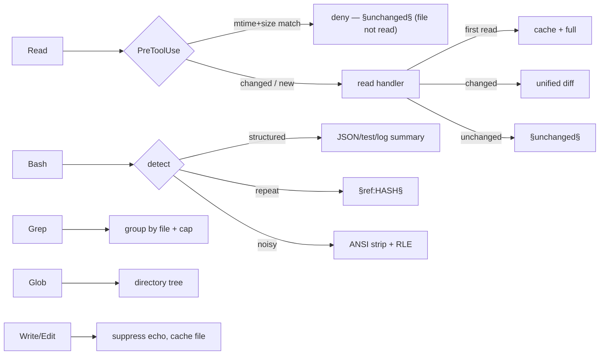

# qdf-hook

[](https://github.com/alex60217101990/terse/actions/workflows/ci.yml)
[](https://github.com/alex60217101990/terse/actions/workflows/codeql.yml)
[](https://github.com/alex60217101990/terse/actions/workflows/govulncheck.yml)
[](https://securityscorecards.dev/viewer/?uri=github.com/alex60217101990/terse)
[](https://pkg.go.dev/github.com/alex60217101990/terse)
[](https://goreportcard.com/report/github.com/alex60217101990/terse)
[](LICENSE)

**Stop paying for the same tokens twice.** `qdf-hook` is a set of
[Claude Code](https://docs.anthropic.com/en/docs/claude-code) hooks that
intercept tool output and collapse the redundant, repeated, and re-read parts
before they ever reach the model's context — cutting **50–99 %** of the tokens
your dev tools would otherwise burn.

```text
Re-read an unchanged 500-line file   →  not read at all  (−100 %)
1000-row JSON from a Bash command     →  ~300 chars        (−99.5 %)
Repeated command output (any tool)    →  §ref token        (−98.2 %)
go test -v, 50 tests pass             →  3 lines           (−99 %)
```

Measured end-to-end on a realistic mixed session: **−72 % tokens**, trending to
**90 %+** as a session re-reads and re-runs. Every hot path runs in **tens of
microseconds** — a sub-1 % sliver of the process-spawn cost, so the savings are
effectively free. An optional resident daemon (`qdf-hookd`) cuts the per-hook
cost further still: a warm daemon roundtrip is **~59.7 µs** versus **~6.97 ms**
for a fresh CLI spawn — about **117×**.

- ⚡ **Fast** — re-read of an unchanged file: **49 µs**; a `§ref` cache hit:
  **3.6 µs**; JSON analysis of 1000 rows: **269 µs**; warm daemon roundtrip:
  **~59.7 µs** (vs **~6.97 ms** for a fresh CLI spawn).
- 🧠 **Context-aware** — tracks what the model already saw *this session and
  across sessions* and serves a reference instead of the bytes.
- 🔒 **Safe** — never changes what a tool *does*; only compresses what the model
  *sees*. A cache miss is always a fresh, correct read.
- 🚀 **One-command install.** Single static binary, nothing to hand-edit. A
  resident daemon starts itself in the background — there's still nothing to
  run by hand.

---

## Quick start

```bash
# 1. install (Homebrew — installs qdf-hook + the native qdf-hookc client)
brew install alex60217101990/tap/qdf-hook

# 2. wire it into Claude Code — idempotent, preserves your existing settings
qdf-hook init

# 3. restart Claude Code. That's it.
```

Upgrade later with `brew upgrade qdf-hook` (re-run `qdf-hook init` once after a
major upgrade to refresh the hook wiring). Prefer Go? `go install
github.com/alex60217101990/terse/cmd/qdf-hook@latest` installs the daemon/CLI;
the native `qdf-hookc` client then comes from a release asset or `make install`.

`qdf-hook init` merges every hook into your global `~/.claude/settings.json`
(or `qdf-hook init --project` for the current repo's `.claude/settings.json`),
using the binary's absolute path so it resolves without PATH juggling. Re-running
is a no-op; your other hooks and settings are left untouched (and backed up).

Check it's paying off after a few tool calls:

```bash
qdf-hook stats            # aggregate token savings this session
```

<details>
<summary>Manual configuration (if you'd rather edit settings.json yourself)</summary>

A single catch-all `PostToolUse` hook now routes every tool through `post`,
which dispatches internally — new tools need no config change. `PostToolUse`
and `PreToolUse` talk to the resident daemon first through the tiny native
client `qdf-hookc` (installed next to `qdf-hook`), falling back to the plain
CLI subcommand when the daemon isn't up or the client is absent:

```json
{
  "hooks": {
    "PreToolUse": [
      {"matcher": "Read", "hooks": [{"type": "command", "command": "qdf-hookc ~/.qdf-hook/d.sock 2>/dev/null || qdf-hook pretooluse"}]}
    ],
    "PostToolUse": [
      {"matcher": ".*", "hooks": [{"type": "command", "command": "qdf-hookc ~/.qdf-hook/d.sock 2>/dev/null || qdf-hook post"}]}
    ],
    "PreCompact":   [{"matcher": ".*", "hooks": [{"type": "command", "command": "qdf-hook precompact"}]}],
    "PostCompact":  [{"matcher": ".*", "hooks": [{"type": "command", "command": "qdf-hook postcompact"}]}],
    "SessionStart": [{"matcher": "",   "hooks": [{"type": "command", "command": "qdf-hook daemon --ensure"}]}]
  }
}
```
</details>

---

## Why it saves tokens

Every byte a tool returns to Claude Code enters the model's context **and stays
there** for the rest of the session — you pay for it again on every turn. The
three biggest offenders in a normal dev session:

1. **Re-reading files.** Read `main.go`, edit elsewhere, read it again — the full
   file lands in context twice.
2. **Repeated command output.** `go test`, `git status`, a deploy log — run
   again, and the identical output is re-ingested in full.
3. **Structured & noisy dumps.** A 1000-row JSON array, a verbose test log, or a
   progress bar redrawing 500 times carries far more bytes than *information*.

`qdf-hook` attacks all three (see **[docs/ARCHITECTURE.md](docs/ARCHITECTURE.md)**
for the deep dive):

- A **`PreToolUse` interceptor** denies re-reading a file whose mtime **and** size
  are unchanged — the file is **never read**, so the tokens are never spent.
- A **content-addressed `§ref` store** replaces any byte-identical repeated
  output (any command, any tool, across sessions) with a 13-token reference.
- **Structural summarizers** turn JSON arrays, `go test -v`, `git log`, and
  benchmark output into compact schemas and counts.
- A **Grep grouper** collapses matches per file; a **squeezer** strips ANSI and
  run-length-collapses repeated lines; a **delta engine** serves a unified diff
  when a re-read file changed only slightly.

The only lever local tooling has is *how many text tokens enter the context
window* — that is exactly what `qdf-hook` minimizes.

---

## Benchmarks

Full methodology and raw numbers: **[docs/BENCHMARKS.md](docs/BENCHMARKS.md)**.

### Token savings (measured through the real binary)

| Scenario | Before | After | Reduction |
| --- | --- | --- | --- |
| Re-read unchanged 500-line file (PreToolUse deny) | 500 lines | 0 (not read) | **−100 %** |
| Re-read unchanged file (PostToolUse) | ~12 KB | ~150 B | **~−99 %** |
| 1000-row JSON array from Bash | ~60 KB | ~300 B | **−99.5 %** |
| Repeated unstructured output (7 KB log) | 7 179 B | 131 B | **−98.2 %** |
| `go test -v`, 50 tests pass | 300 lines | 3 lines | **−99 %** |
| Write a 500-line file | 500 lines | 1 line | **−99.8 %** |
| **Realistic mixed session (7 ops)** | **216.9 KB** | **60.2 KB** | **−72.3 %** |

### Latency (per hook op, Apple Silicon; `benchstat`, n ≥ 12)

| Operation | Time | Allocs |
| --- | --- | --- |
| PreToolUse, unchanged file (deny) | **49 µs** | 54 |
| `§ref` cache hit | **3.6 µs** | 12 |
| Session state Save + Load | **69 µs** | 29 |
| JSON analysis (1000 rows) | **269 µs** | 2 068 |
| Daemon roundtrip (warm `qdf-hookd`) | **~59.7 µs** | — |
| CLI roundtrip (fresh process spawn) | **~6.97 ms** | — |

Launching the hook process itself costs Claude Code **~1–6 ms** of spawn +
runtime init; qdf-hook's own work is a **sub-1 % sliver** of that. The resident
daemon (`qdf-hookd`) removes the spawn cost entirely for warmed-up sessions: a
request answered from its shared in-RAM store is **~117×** faster than a fresh
CLI invocation of the same pipeline.

---

## How it works



- **Read** — PreToolUse denies unchanged re-reads (mtime+size); PostToolUse serves
  `§unchanged§`, a unified diff, or full content on first read. Windowed reads
  (an `offset`/`limit` or a partial `startLine`/`numLines` window) always pass
  through uncached — caching a slice would poison delta tracking for the whole
  file.
- **Bash** — structural summarizers → `§ref` dedup of repeats → ANSI/RLE squeeze
  → pass through.
- **Grep** — group content matches per file (capped) or delegate a file list to
  the tree compressor.
- **Glob** — flat list → directory tree. **Write/Edit** — suppress echo, cache the
  real file for the next delta (Write/Edit/MultiEdit tool responses carry no
  plain-text field — the hook resolves `originalFile`/`structuredPatch`
  instead). **Compaction** — force full re-read + file manifest.

### Resident daemon (`qdf-hookd`)

Every hook invocation above still pays Claude Code's `exec` cost — spawning a
fresh process and re-decoding the on-disk cache — even though qdf-hook's own
logic runs in tens of microseconds. `qdf-hookd` removes that spawn: it's a
long-lived process, started (and version-checked) at `SessionStart` via
`qdf-hook daemon --ensure`, that answers hook requests over a unix socket
(`~/.qdf-hook/d.sock`) against one shared in-RAM state store instead of a
per-invocation disk round trip.

The `PostToolUse`/`PreToolUse` hooks are a **hybrid client**: `qdf-hookc <sock>
2>/dev/null || <exe> <sub>` talks to the daemon when it's up and falls back to
the plain CLI when it isn't. `qdf-hookc` is a tiny native AF_UNIX socket client
(a single C file cross-compiled with `zig cc`, shipped as a release asset and
in the `qdf-hookc` container image) installed next to `qdf-hook`; it does one
thing — stream stdin to the socket and the reply back — with no `nc`
portability quirks. If it's missing (e.g. Windows, which has no native client),
the shell `||` runs `<exe> <sub>` directly. A `PING` handshake carrying the
binary's version lets `daemon --ensure` detect and replace a stale daemon after
an upgrade; `QUIT` requests a clean shutdown; an idle daemon exits on its own
after 30 minutes. The daemon restores `GOMAXPROCS(NumCPU)` and the garbage
collector on start — the one-shot CLI disables both for startup speed, but a
long-lived process needs them.

Every persisted store is a rebuildable cache written with a single plain write
and serialized with [`qdf`](https://github.com/alex60217101990/qdf)
(~38× faster decode than JSON); decode and hashing are zero-copy. A `§ref` is
emitted only when the current output's hash already has a stored blob, so it can
never point at stale or wrong content. The `refs/` and rerun-delta `last/`
stores are bounded: `gc` (run automatically, throttled to at most once per 24h
at `SessionStart`, and on a 10-minute sweep inside the daemon) evicts the
lowest-utility blobs — hits × exponential time-decay — once total size exceeds
`--cache-max-size` (default 128 MiB) or an entry is older than `--cache-ttl`
(default 720h / 30 days).

---

## Subcommands

| Subcommand | Purpose |
| --- | --- |
| `init` | **Install all hooks into Claude Code settings.json** (idempotent) |
| `post` | Universal `PostToolUse` hook — routes any tool through the pipeline |
| `pretooluse` | Deny re-read of an unchanged file (mtime+size) |
| `read` | `§unchanged§` / unified-diff compression (standalone; superseded by `post`) |
| `bash` | Structured summaries + `§ref` dedup + ANSI/RLE squeeze (standalone; superseded by `post`) |
| `write` | Suppress content echo, prime delta cache (standalone; superseded by `post`) |
| `glob` / `grep` | File tree / grouped matches (standalone; superseded by `post`) |
| `precompact` / `postcompact` | Full re-read + file manifest around compaction |
| `sessionstart` | `SessionStart` hook logic (invoked via `daemon --ensure`) |
| `daemon --serve` | Run the `qdf-hookd` serve loop in the foreground |
| `daemon --ensure` | Start/refresh `qdf-hookd`, replacing a stale version; throttled disk-cache gc |
| `stats` | Token-savings + latency analytics (`--json`, `--style line\|braille`) |
| `gc` | Evict low-utility sessions + bounded `refs/`/`last/` blobs (`--dry-run`) |
| `expand <hash>` | Print the full content behind a `§ref:HASH§` token |
| `version` | Print version |

Global flags: `--cpuprofile FILE`, `--memprofile FILE`.

`qdf-hook init` installs a single catch-all `PostToolUse` hook (`post`) plus the
`PreToolUse`/`SessionStart` hooks; the per-tool subcommands (`read`, `bash`,
`write`, `glob`, `grep`) still work standalone but are superseded by `post` and
pruned from `settings.json` on re-`init`.

## Configuration

| Variable | Default | Effect |
| --- | --- | --- |
| `QDF_CACHE_MAX_SIZE` | `128 MiB` | Combined size cap for `refs/` + `last/` before `gc` evicts |
| `QDF_CACHE_TTL` | `720h` (30 d) | Max age of a cache entry before `gc` prunes it regardless of size |
| `QDF_DECAY_LAMBDA` | `0.1` | Decay rate for utility-score eviction (sessions and blobs) |
| `QDF_SKIP_TOOLS` | *(none)* | Comma-separated tool names to always pass through verbatim |

`--cache-max-size` and `--cache-ttl` flags on `daemon` and `gc` override the
env vars for a single invocation.

State lives under `~/.qdf-hook/` (`sessions/`, `refs/`, `last/`, `d.sock`,
`analytics.jsonl`) and is a rebuildable cache — safe to delete anytime (the
daemon will restart itself and the caches will refill).

## FAQ

**Does it change what my commands do?** No. Hooks run *after* a tool executes, or
only *deny* a redundant re-read. Never mutates files or command behavior.

**A `§ref` blob I need is gone?** `qdf-hook expand <hash>`. In practice the model
rarely needs it — a `§ref` means it already saw that exact output.

**Safe across crashes / concurrent hooks?** Yes — state is content-addressed and
rebuildable; a torn write is treated as a cache miss. A daemon connection that
panics is recovered per-connection and just closes without a reply, so the
hybrid client's CLI fallback covers it.

**Do I need to manage the daemon myself?** No. `SessionStart` runs
`daemon --ensure`, which starts it if it's not running, replaces it if it's a
stale version, and is a no-op otherwise. It exits on its own after 30 minutes
idle. To stop it early, send it `QUIT` (e.g. `printf 'QUIT\n' | qdf-hookc
~/.qdf-hook/d.sock`) — it flushes and shuts down cleanly.

**What if `qdf-hookc` isn't installed?** The hybrid command falls back to the
plain CLI subcommand whenever the native client is missing or fails to connect
— you lose the daemon speedup, not correctness. `qdf-hookc` ships as a release
asset (and container image) per OS/arch; `qdf-hook init` wires it in only when
it's found next to the `qdf-hook` binary.

**Plays nice with other hooks (sqz, atuin, …)?** Yes; `qdf-hook init` preserves
them. They compose.

## Contributing

See **[CONTRIBUTING.md](CONTRIBUTING.md)**. The one hard rule: **measure before
you optimize** — every perf change is gated by an interleaved `benchstat` run.

```bash
go test -race ./...
go test -bench=. -benchmem -count=6 ./...
```

## License

[Apache 2.0](LICENSE) © 2026 the qdf-hook authors.
