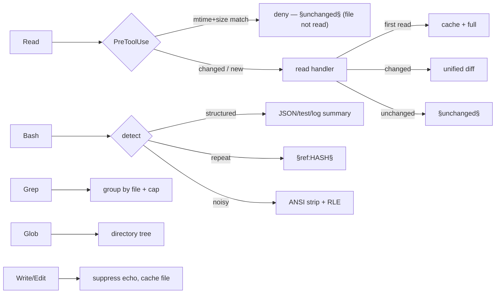

# qdf-hook

**Stop paying for the same tokens twice.** `qdf-hook` is a set of
[Claude Code](https://docs.anthropic.com/en/docs/claude-code) hooks that
intercept tool output and collapse the redundant, repeated, and re-read parts
before they ever reach the model's context — cutting **50–99 %** of the tokens
your dev tools would otherwise burn.

```text
Re-read an unchanged 500-line file   →  not read at all  (−100 %)
1000-row JSON from a Bash command     →  ~300 chars        (−99.5 %)
Repeated command output (any tool)    →  §ref token        (−98.2 %)
go test -v, 50 tests pass             →  3 lines           (−99 %)
```

Measured end-to-end on a realistic mixed session: **−72 % tokens**, trending to
**90 %+** as a session re-reads and re-runs. Every hot path runs in **tens of
microseconds** — a sub-1 % sliver of the process-spawn cost, so the savings are
effectively free.

- ⚡ **Fast** — re-read of an unchanged file: **49 µs**; a `§ref` cache hit:
  **3.6 µs**; JSON analysis of 1000 rows: **269 µs**.
- 🧠 **Context-aware** — tracks what the model already saw *this session and
  across sessions* and serves a reference instead of the bytes.
- 🔒 **Safe** — never changes what a tool *does*; only compresses what the model
  *sees*. A cache miss is always a fresh, correct read.
- 🚀 **One-command install.** No daemon, single static binary, nothing to hand-edit.

---

## Quick start

```bash
# 1. install the binary (Go 1.26+)
go install github.com/alex60217101990/qdf-hook/cmd/qdf-hook@latest

# 2. wire it into Claude Code — idempotent, preserves your existing settings
qdf-hook init

# 3. restart Claude Code. That's it.
```

`qdf-hook init` merges every hook into your global `~/.claude/settings.json`
(or `qdf-hook init --project` for the current repo's `.claude/settings.json`),
using the binary's absolute path so it resolves without PATH juggling. Re-running
is a no-op; your other hooks and settings are left untouched (and backed up).

Check it's paying off after a few tool calls:

```bash
qdf-hook stats            # aggregate token savings this session
```

<details>
<summary>Manual configuration (if you'd rather edit settings.json yourself)</summary>

```json
{
  "hooks": {
    "PreToolUse": [
      {"matcher": "Read", "hooks": [{"type": "command", "command": "qdf-hook pretooluse"}]}
    ],
    "PostToolUse": [
      {"matcher": "Read", "hooks": [{"type": "command", "command": "qdf-hook read"}]},
      {"matcher": "Bash", "hooks": [{"type": "command", "command": "qdf-hook bash"}]},
      {"matcher": "Write|Edit|MultiEdit", "hooks": [{"type": "command", "command": "qdf-hook write"}]},
      {"matcher": "Glob", "hooks": [{"type": "command", "command": "qdf-hook glob"}]},
      {"matcher": "Grep", "hooks": [{"type": "command", "command": "qdf-hook grep"}]}
    ],
    "PreCompact":  [{"matcher": ".*", "hooks": [{"type": "command", "command": "qdf-hook precompact"}]}],
    "PostCompact": [{"matcher": ".*", "hooks": [{"type": "command", "command": "qdf-hook postcompact"}]}]
  }
}
```
</details>

---

## Why it saves tokens

Every byte a tool returns to Claude Code enters the model's context **and stays
there** for the rest of the session — you pay for it again on every turn. The
three biggest offenders in a normal dev session:

1. **Re-reading files.** Read `main.go`, edit elsewhere, read it again — the full
   file lands in context twice.
2. **Repeated command output.** `go test`, `git status`, a deploy log — run
   again, and the identical output is re-ingested in full.
3. **Structured & noisy dumps.** A 1000-row JSON array, a verbose test log, or a
   progress bar redrawing 500 times carries far more bytes than *information*.

`qdf-hook` attacks all three (see **[docs/ARCHITECTURE.md](docs/ARCHITECTURE.md)**
for the deep dive):

- A **`PreToolUse` interceptor** denies re-reading a file whose mtime **and** size
  are unchanged — the file is **never read**, so the tokens are never spent.
- A **content-addressed `§ref` store** replaces any byte-identical repeated
  output (any command, any tool, across sessions) with a 13-token reference.
- **Structural summarizers** turn JSON arrays, `go test -v`, `git log`, and
  benchmark output into compact schemas and counts.
- A **Grep grouper** collapses matches per file; a **squeezer** strips ANSI and
  run-length-collapses repeated lines; a **delta engine** serves a unified diff
  when a re-read file changed only slightly.

The only lever local tooling has is *how many text tokens enter the context
window* — that is exactly what `qdf-hook` minimizes.

---

## Benchmarks

Full methodology and raw numbers: **[docs/BENCHMARKS.md](docs/BENCHMARKS.md)**.

### Token savings (measured through the real binary)

| Scenario | Before | After | Reduction |
| --- | --- | --- | --- |
| Re-read unchanged 500-line file (PreToolUse deny) | 500 lines | 0 (not read) | **−100 %** |
| Re-read unchanged file (PostToolUse) | ~12 KB | ~150 B | **~−99 %** |
| 1000-row JSON array from Bash | ~60 KB | ~300 B | **−99.5 %** |
| Repeated unstructured output (7 KB log) | 7 179 B | 131 B | **−98.2 %** |
| `go test -v`, 50 tests pass | 300 lines | 3 lines | **−99 %** |
| Write a 500-line file | 500 lines | 1 line | **−99.8 %** |
| **Realistic mixed session (7 ops)** | **216.9 KB** | **60.2 KB** | **−72.3 %** |

### Latency (per hook op, Apple Silicon; `benchstat`, n ≥ 12)

| Operation | Time | Allocs |
| --- | --- | --- |
| PreToolUse, unchanged file (deny) | **49 µs** | 54 |
| `§ref` cache hit | **3.6 µs** | 12 |
| Session state Save + Load | **69 µs** | 29 |
| JSON analysis (1000 rows) | **269 µs** | 2 068 |

Launching the hook process itself costs Claude Code **~1–6 ms** of spawn +
runtime init; qdf-hook's own work is a **sub-1 % sliver** of that.

---

## How it works



- **Read** — PreToolUse denies unchanged re-reads (mtime+size); PostToolUse serves
  `§unchanged§`, a unified diff, or full content on first read.
- **Bash** — structural summarizers → `§ref` dedup of repeats → ANSI/RLE squeeze
  → pass through.
- **Grep** — group content matches per file (capped) or delegate a file list to
  the tree compressor.
- **Glob** — flat list → directory tree. **Write/Edit** — suppress echo, cache the
  real file for the next delta. **Compaction** — force full re-read + file
  manifest.

Every persisted store is a rebuildable cache written with a single plain write
and serialized with [`qdf`](https://github.com/alex60217101990/qdf)
(~38× faster decode than JSON); decode and hashing are zero-copy. A `§ref` is
emitted only when the current output's hash already has a stored blob, so it can
never point at stale or wrong content.

---

## Subcommands

| Subcommand | Purpose |
| --- | --- |
| `init` | **Install all hooks into Claude Code settings.json** (idempotent) |
| `pretooluse` | Deny re-read of an unchanged file (mtime+size) |
| `read` | `§unchanged§` / unified-diff compression |
| `bash` | Structured summaries + `§ref` dedup + ANSI/RLE squeeze |
| `write` | Suppress content echo, prime delta cache |
| `glob` / `grep` | File tree / grouped matches |
| `precompact` / `postcompact` | Full re-read + file manifest around compaction |
| `stats` | Token-savings analytics (`--json`) |
| `gc` | Evict low-utility sessions + old `§ref` blobs (`--dry-run`) |
| `expand <hash>` | Print the full content behind a `§ref:HASH§` token |
| `version` | Print version |

Global flags: `--cpuprofile FILE`, `--memprofile FILE`.

## Configuration

| Variable | Default | Effect |
| --- | --- | --- |
| `QDF_REF_TTL_HOURS` | `168` (7 d) | Max age of a `§ref` blob before `gc` prunes it |
| `QDF_DECAY_LAMBDA` | `0.1` | Decay rate for session eviction utility |

State lives under `~/.qdf-hook/` (`sessions/`, `refs/`, `analytics.jsonl`) and is
a rebuildable cache — safe to delete anytime.

## FAQ

**Does it change what my commands do?** No. Hooks run *after* a tool executes, or
only *deny* a redundant re-read. Never mutates files or command behavior.

**A `§ref` blob I need is gone?** `qdf-hook expand <hash>`. In practice the model
rarely needs it — a `§ref` means it already saw that exact output.

**Safe across crashes / concurrent hooks?** Yes — state is content-addressed and
rebuildable; a torn write is treated as a cache miss.

**Plays nice with other hooks (sqz, atuin, …)?** Yes; `qdf-hook init` preserves
them. They compose.

## Contributing

See **[CONTRIBUTING.md](CONTRIBUTING.md)**. The one hard rule: **measure before
you optimize** — every perf change is gated by an interleaved `benchstat` run.

```bash
go test -race ./...
go test -bench=. -benchmem -count=6 ./...
```

## License

[Apache 2.0](LICENSE) © 2026 the qdf-hook authors.
