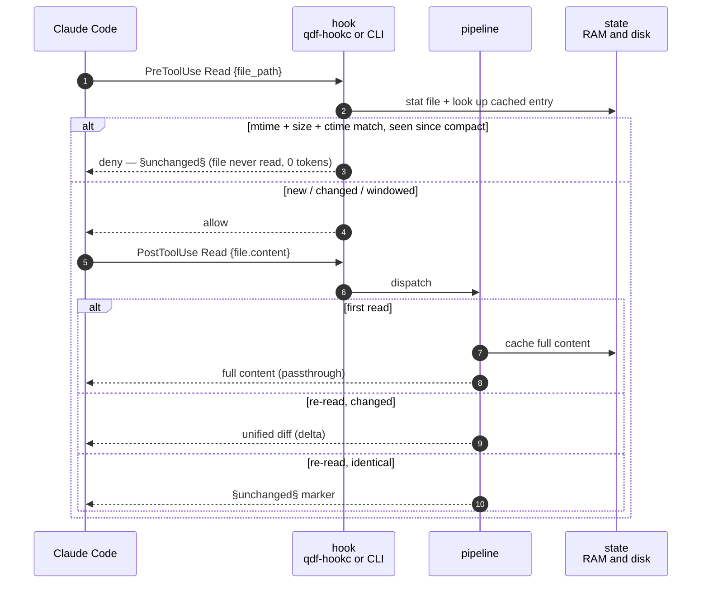
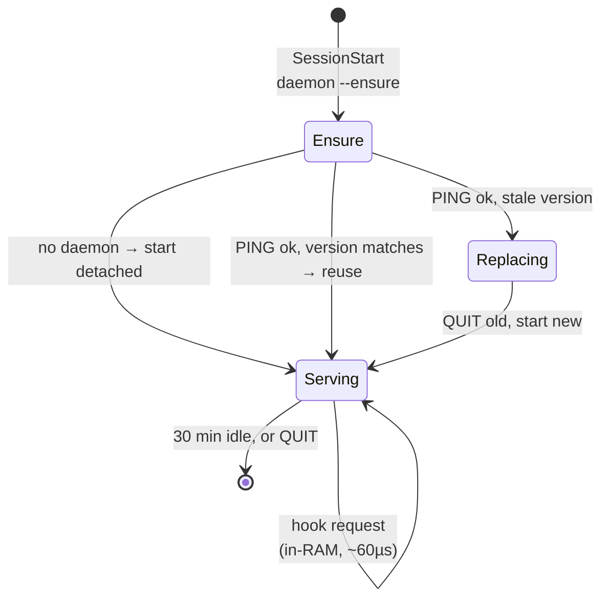

# Architecture

`qdf-hook` is a single static binary invoked by Claude Code as a hook command.
It has two run modes:

- **One-shot CLI** — the original mode: one process per tool event. Each
  invocation reads a JSON event on stdin, decides how to compress the tool's
  output, writes a hook response on stdout, and exits. All coordination happens
  through small files under `~/.qdf-hook/`.
- **Resident daemon (`qdf-hookd`)** — an optional long-lived process, started
  by `qdf-hook daemon --serve` (or ensured by `qdf-hook daemon --ensure` at
  `SessionStart`), that answers the same hook requests over a unix socket
  against one shared in-RAM store instead of spawning a process and
  re-decoding disk state on every call. `PostToolUse`/`PreToolUse` are wired as
  a **hybrid client** (`nc <flags> -U <sock> || <exe> <sub>`) that talks to the
  daemon when it's up and falls back to the one-shot CLI otherwise — so the
  daemon is a pure latency optimization, never a correctness dependency.

## Data flow

One-shot CLI:

```
Claude Code event ──stdin(JSON)──▶ qdf-hook <subcommand> ──stdout(JSON)──▶ Claude Code
                                          │
                                          ├── reads/writes ~/.qdf-hook/sessions/<id>.qdf
                                          ├── reads/writes ~/.qdf-hook/refs/<hash>.blob
                                          └── appends      ~/.qdf-hook/analytics.jsonl
```

Resident daemon:

```
Claude Code event ──stdin(JSON)──▶ qdf-hookc ~/.qdf-hook/d.sock ──▶ qdf-hookd ──▶ qdf-hookc stdout ──▶ Claude Code
                                                                     │
                                                                     ├── one shared hookcore.MemStore (RAM)
                                                                     ├── periodic FlushDirty() → same ~/.qdf-hook/ files
                                                                     ├── periodic SweepBlobs() → refs/ + last/ eviction
                                                                     └── appends ~/.qdf-hook/analytics.jsonl (same format)
```

`qdf-hookc` failing to connect (no daemon running) falls through the `||` to
the plain `qdf-hook <sub>` one-shot path, so both modes produce byte-identical
hook output — the daemon only changes how fast it arrives.

A `Read` round-trip shows the two ways it can end — denied before execution, or
compressed after:



## Packages

| Package | Responsibility |
| --- | --- |
| `cmd/qdf-hook` | CLI: one subcommand per hook; profiling flags; `stats`/`gc`/`expand`/`daemon`/`init`. |
| `internal/protocol` | Hook wire types; decode stdin / encode stdout. |
| `internal/hook` | One handler per tool (`HandleRead`, `HandleBash`, …) plus `Dispatch`/`DispatchBytes`, the single `PostToolUse` routing entry point shared by the CLI and the daemon. Orchestration only. |
| `internal/hookcore` | The `StateStore` interface and its two implementations: `DiskStore` (CLI, one file per session/blob) and `MemStore` (daemon, one shared in-RAM map, safe for concurrent connections). |
| `internal/daemon` | `qdf-hookd`'s socket serve loop (`Serve`), lifecycle management (`Ensure`, PING/QUIT handshake), and the periodic flush/sweep tickers. |
| `internal/detect` | Pure output analysis: JSON columnar stats, `go test`/`git log`/bench summarizers, `SqueezeOutput`. No I/O. |
| `internal/summary` | Human-readable rendering of `detect` stats. |
| `internal/cache` | Persistence: session state, content-addressed `§ref` store, rerun-delta `last/` store, unified diff, bounded-cache eviction (`gc`, `AutoSweep`, `SweepBlobs`). |
| `internal/analytics` | Append-only event log + `stats` aggregation (token savings, latency percentiles). Shared by both run modes — the daemon and the CLI append to the same `analytics.jsonl`. |

The split keeps `detect` pure and table-testable, `cache` responsible for all
disk I/O, `hook` a thin orchestration layer shared by both run modes, and
`hookcore` the seam that lets the same handlers run against either a disk-backed
or an in-RAM store.

## Core mechanisms

### 1. PreToolUse read interception (the biggest lever)

Re-reading a file is the #1 token sink. Before a `Read` executes, the
`pretooluse` handler stats the file and compares mtime **and** size against the
cached entry. If both match (and the file was seen after the last compaction),
it returns `permissionDecision: "deny"` with a `§unchanged§` reason — **the file
is never read**, so the tokens are never spent.

mtime alone is insufficient (`cp -p`, `rsync --times`, coarse NFS clocks can
preserve it across a change), so the size check — free, already in the stat —
closes the common holes. The residual case (same mtime *and* size, different
content) only costs a missed compression, never wrong content.

This path deliberately does **not** persist anything: bumping a usage counter is
not worth a full state rewrite (~160 µs of syscalls) on the hottest path.

### 2. Content-addressed §ref dedup

Any tool output byte-identical to something already emitted collapses to a
`§ref:HASH§` token. `HASH = sha256(output)[:16]`; the blob lives at
`~/.qdf-hook/refs/<hash>.blob`. The filesystem *is* the registry — one `stat`
tells us whether we've seen this output.

Safe by construction: a `§ref` is emitted only after hashing the **current**
output and finding its blob, so the blob always equals the current bytes. No
staleness, works across sessions. `qdf-hook expand <hash>` reconstructs the full
content on demand.

This generalizes and replaces the older read-only bash cache (which was
whitelist-gated, single-session, and byte-identical only).

### 3. Delta tracking

The `read` handler caches each file's content. On a re-read where the content
changed, it computes a Myers unified diff (`internal/cache/delta.go`) and returns
`[§delta:HASH§]` + the diff instead of the whole file. A hard guard falls back
to full content when the diff would be pathologically large (O((N+M)²) Myers).

A **windowed** read — `tool_input.offset`/`limit` set, or the response's file
metadata shows `startLine > 1` or `numLines < totalLines` — is detected and
passed through uncached rather than diffed or fed into the unchanged-file
cache: caching a partial view under the file's key would poison later
full-read comparisons with a hash that reflects only the window, not the file.

### 4. Real `tool_response` shapes

The handlers key off the *actual* payload Claude Code sends, which differs by
tool:

- **Read** nests the file text under `tool_response.file.content`, with window
  metadata alongside it (`startLine`, `numLines`, `totalLines`) — there is no
  top-level `tool_response.content` for this tool.
- **Edit/MultiEdit** carry no plain-text field at all: the response has
  `originalFile`, `oldString`/`newString`, and `structuredPatch`. `originalFile`
  is the *whole* pre-edit file, so it can be as large as the file itself —
  `write.go` treats it accordingly rather than assuming a small diff payload.
- **Bash** uses `stdout`/`stderr`.

`protocol.HookOutput.Text()` (and the per-tool handlers) resolve these shapes
so a Read isn't mistaken for an empty response and an Edit's `originalFile`
isn't mistaken for a top-level content field.

### 5. Structural summarizers

`internal/detect` recognizes and compresses common shapes: JSON arrays →
columnar schema + per-column stats; `go test -v` → pass/fail counts + only the
failures; `git log` → compact commit table; `go test -bench` → aligned table.
Each is gated so it only fires when it at least halves the output.

### 6. Generic squeeze

Output that no structural detector matched, and that isn't a `§ref` repeat, goes
through `SqueezeOutput`: ANSI/VT escape stripping + run-length collapse of
identical consecutive lines (`line ⨯N`). Self-describing, gated at ≥10 % win.

### 7. Resident daemon and hybrid client

Lifecycle — `SessionStart` runs `daemon --ensure`, which starts, reuses, or
version-replaces the daemon; it exits itself after 30 min idle:



`internal/daemon.Serve` listens on `~/.qdf-hook/d.sock` and dispatches every
connection through the same `hook.DispatchBytes` the CLI's `post` subcommand
uses, against one shared `hookcore.MemStore` instead of `DiskStore`. Each
connection is handled on its own goroutine (a bounded per-connection deadline
prevents a stuck client from wedging the daemon), and a background loop in the
same `Serve` call flushes dirty state to disk every 5 s and sweeps the `refs/`
and `last/` blob caches to their bounds every 10 minutes — so a crash or `QUIT`
never loses more than one flush interval's worth of state, and long-lived
sessions still get bounded caches without a CLI invocation to trigger `gc`.

`daemon.Ensure` (run via `qdf-hook daemon --ensure`, wired to `SessionStart`)
dials the socket and sends a bare `PING`; a reply of `"qdf-hookd <version>"`
matching the running binary means the daemon is live and current (no-op). A
mismatched version means a stale daemon from before an upgrade — `Ensure`
sends it `QUIT`, waits for the socket to clear, and starts a fresh one
(`exec.Command(..., "daemon", "--serve")` with `Setsid: true`, detached, its
stderr redirected to `~/.qdf-hook/daemon.log` rather than discarded). No reply
at all means nothing is listening — `Ensure` starts one directly. Either way it
polls `PING` for up to ~2 s before returning, so callers only see success once
the daemon is actually serving.

The installed hook command is generated by `hookCommand` in
`cmd/qdf-hook/init.go`: `qdf-hookc <sock> 2>/dev/null || <exe> <sub>`. The
native client `qdf-hookc` (a single C file in `client/qc.c`, cross-compiled
with `zig cc` — see `make client-all`) does exactly one thing: connect to the
AF_UNIX socket, stream stdin to it, then half-close the write side so the
daemon's `io.ReadAll`-to-EOF unblocks, and copy the reply back. Purpose-built,
it sidesteps the `nc` portability quirks the earlier hybrid relied on (macOS's
`/usr/bin/nc` has no `-N`; OpenBSD's needs it). It's resolved next to the
`qdf-hook` binary via `filepath.Dir(exe)`; if it's absent — notably Windows,
which has no native client — `hookCommand` emits `<exe> <sub>` directly, and
the shell `||` covers a client that's present but fails to connect.

The daemon and the one-shot CLI share the same `hook` package, `protocol`
types, and `analytics` event format — the only thing that differs is which
`hookcore.StateStore` backs a given call and whether the process already
existed. `main.init()`'s `GOMAXPROCS(1)` + `SetGCPercent(-1)` tuning (fast
one-shot startup) is undone by `restoreDaemonRuntime()` before `daemon --serve`
runs its loop, since a long-lived concurrent process needs the garbage
collector and all Ps.

## Persistence choices

- **Format:** [`qdf`](https://github.com/alex60217101990/qdf), not JSON. Session
  state and `§ref` blobs use `OptBalanced` — ~38× faster decode than JSON at
  equal wire size, which matters because Load runs on every hook.
- **Zero-copy decode:** `qdf.WithNoCopy()` aliases decoded strings/bytes into the
  read buffer (safe: the buffer outlives the value and is never mutated),
  cutting decode allocations ~74 %.
- **Writes:** plain `os.WriteFile`, no tmp+rename. Every state file is a
  rebuildable cache; a torn write from a crash or a concurrent hook simply fails
  to decode on the next Load, which returns a fresh empty state. The atomic
  rename bought nothing and cost a syscall on every hook.
- **No `fsync`:** cross-process visibility rides the page cache (correct, since
  the next hook is a new process reading the same file); durability is not
  required for a cache.

## Eviction (`gc`)

`gc` prunes three things:

- **Session files** by a utility score (read frequency × recency with
  exponential decay, `internal/cache/evict.go`).
- **`refs/` and `last/` blobs** by the same utility-score model — hits ×
  exponential decay of time-since-last-use — once their combined size exceeds
  `--cache-max-size`/`QDF_CACHE_MAX_SIZE` (default 128 MiB), after first
  dropping anything older than `--cache-ttl`/`QDF_CACHE_TTL` (default 720 h /
  30 days) as a hard floor regardless of score.

`--dry-run` reports what would be removed without deleting. `gc` runs
automatically in two places so a CLI-only or daemon-only user both get it:
throttled to at most once per 24 h inside `daemon --ensure` at `SessionStart`
(`cache.AutoSweep`), and on a 10-minute sweep ticker inside a running
`qdf-hookd` (`cache.SweepBlobs`, called from `daemon.Serve`'s loop). `qdf-hook
gc` remains available for a manual, unthrottled run.

## Why it's safe

- Hooks never mutate files or change command behavior — they run after execution
  (or only deny a redundant read).
- Every cache is content-addressed or rebuildable; the failure mode is always a
  cache miss (a correct, fresh read), never wrong content or a crash.
- Every compressor is never-worse: it emits the compact form only when it is
  strictly smaller than the original.
- The daemon is never a correctness dependency: the hybrid client's `||`
  falls back to the one-shot CLI whenever `nc` can't reach the socket (not
  running, wrong flags, crashed), and a panic inside a single connection
  handler is recovered and closes the connection without a reply — the caller
  sees exactly the same "daemon unavailable" fallback as a closed socket.
