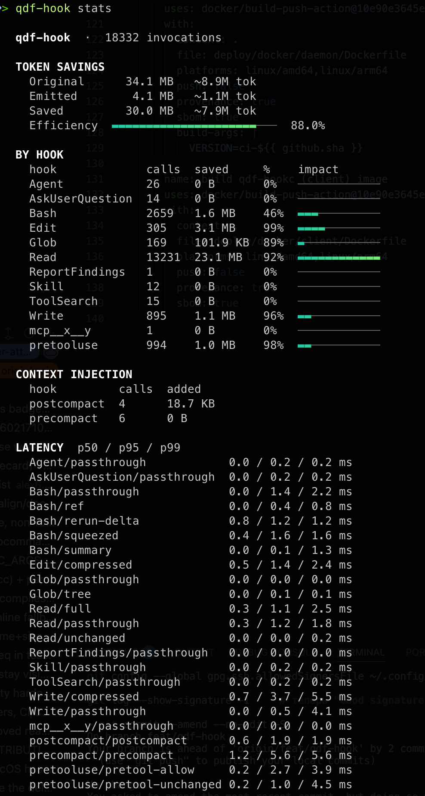
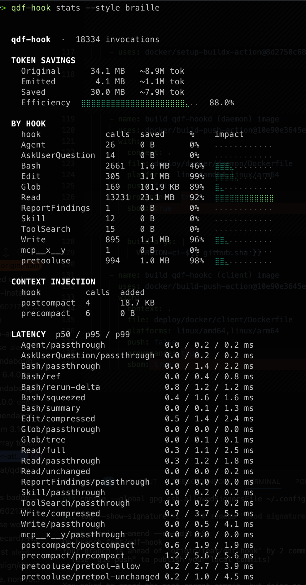

# Benchmarks

All numbers below are **measured**, not estimated. Token savings come from
running the real `qdf-hook` binary over realistic tool inputs and reading its
own `stats` analytics; latency comes from Go benchmarks compared with
`benchstat` (n ≥ 12, interleaved) on Apple Silicon. Absolute nanoseconds are
machine-specific — the ratios are the stable signal.

## Real-world aggregate

Not a benchmark rig — what `qdf-hook` actually recorded across **18,000+ tool
calls** of ordinary Claude Code use on one machine, read straight from its own
`stats` analytics:

| | Bytes | ~Tokens |
| --- | --- | --- |
| Original — what Claude *would* ingest | 34.1 MB | ~8.9M |
| Emitted — what it actually saw | 4.1 MB | ~1.1M |
| **Saved** | **30.0 MB** | **~7.9M — 88.0 %** |

Per hook: **Read 92 %** (13.2k calls, 23 MB saved — the re-read killer),
**Edit 99 %**, **Write 96 %**, **PreToolUse deny 98 %**, **Glob 89 %**,
**Bash 46 %** (many small command outputs correctly pass through). Agent / MCP
/ Skill outputs flow through the pipeline and dedup on repeats.



Same run, denser braille meter (`qdf-hook stats --style braille`):



## Token savings

Measured end-to-end through the compiled binary (`bytes in → bytes emitted`,
tokens ≈ bytes / 4).

| Scenario | Input | Emitted | Reduction |
| --- | --- | --- | --- |
| Re-read unchanged file (PreToolUse deny) | 500 lines | 0 (not read) | **−100 %** |
| Re-read unchanged file (PostToolUse) | ~12 KB | ~150 B | **~−99 %** |
| 1000-row JSON array (Bash) | ~60 KB | ~300 B | **−99.5 %** |
| Repeated unstructured output (deploy log) | 7 179 B | 131 B | **−98.2 %** |
| `go test -v`, 50 tests pass | 300 lines | 3 lines | **−99 %** |
| Write a 500-line file | 500 lines | 1 line | **−99.8 %** |
| Grep, many matches in few files | — | capped + tree | **50–90 %** |
| Glob 50-file listing | 50 lines | ~15 lines | **~−70 %** |
| ANSI/progress-heavy log (squeeze) | — | ANSI stripped + RLE | **varies** |

### Realistic mixed session

Seven mixed operations (two first-reads, one re-read, a 1k-row JSON, a Glob, a
Write, a PreToolUse re-read) through the real binary:

```
Original:  216.9 KB  (~55.5k tokens)
Emitted:    60.2 KB  (~15.4k tokens)
Saved:     156.7 KB  72.3%  (~40.1k tokens)
```

72 % includes two **uncompressed first reads** (a file must be seen once before
it can be deduped). In a real session — where files are read once and re-read or
re-run many times — the ratio trends to **90 %+** as repeats accumulate.

## Latency

Per hook operation. `benchstat`, n ≥ 12, interleaved.

| Operation | Time | Allocs/op |
| --- | --- | --- |
| PreToolUse, unchanged file (deny) | **49 µs** | 54 |
| `§ref` cache hit (repeated output) | **3.6 µs** | 12 |
| `§ref` miss (register blob) | 94 µs | 20 |
| Session state Save + Load | **69 µs** | 29 |
| Unified diff | **49 µs** | 39 |
| JSON analysis (1000 rows) | **263 µs** | 44 |
| Grep group (500 matches) | 134 µs | 144 |
| Squeeze (500 ANSI lines) | 103 µs | 19 |
| `expand` (RefGet) | 17 µs | 13 |

### Context: this is far below the spawn floor

Claude Code `exec`s the hook binary on every event. Process spawn + Go runtime
init alone is **~1–6 ms**. qdf-hook's own work (tens of µs) is a **sub-1 %
sliver** of that — it is never the latency bottleneck, so the token savings come
essentially for free.

## Daemon vs. one-shot CLI roundtrip

`internal/daemon`'s `BenchmarkDaemonRoundtrip` and `BenchmarkCLIRoundtrip` send
the identical fixed payload through the identical `hook.Dispatch` pipeline, so
the measured delta is pure transport overhead — process spawn plus
`DiskStore`'s disk round trip — not differing amounts of compression work:

| Path | Time |
| --- | --- |
| Warm `qdf-hookd`, dial + write + half-close + read | **~59.7 µs** |
| Fresh `qdf-hook post` process (`exec` + stdin/stdout) | **~6.97 ms** |

That's **~117×**. It confirms the daemon's premise: qdf-hook's own compression
logic was already tens of microseconds (see the table above); the ~1–6 ms
Claude Code paid per hook was almost entirely process-spawn and disk-decode
overhead the daemon design set out to remove, and the roundtrip benchmark
shows it actually is removed, not just theoretically eliminated.

Perf work on the daemon path itself — a pooled read buffer for incoming
requests (`internal/daemon`'s request pool) instead of a fresh allocation per
connection, and `DispatchBytes`'s single `json.Unmarshal` instead of wrapping
the request in a `json.Decoder` — trims allocation and copying on the hot
in-RAM path. Both are qualitative wins (fewer allocs, one less buffering
layer) confirmed by the project's tests and benchmarks; no separate
before/after nanosecond figures for those two changes in isolation are
recorded here, since the roundtrip numbers above already capture the warm,
optimized path end to end.

## Optimization history

Each change was `benchstat`-gated and kept only if it cleared the noise.

| Change | Result |
| --- | --- |
| JSON: `encoding/json` → zero-copy `jsonparser` | 1.44 ms → 269 µs (**−81 %**, −93 % allocs) |
| PreToolUse: skip redundant state Save on deny | 221 µs → 49 µs (**−78 %**) |
| Session Save: plain write (drop tmp+rename) | 186 µs → 69 µs (**−63 %**) |
| Session Load: qdf `WithNoCopy` zero-copy decode | 133 → 34 allocs (**−74 %**) |
| Bash cache entries: JSON → qdf `OptBalanced` | ~38× faster decode |
| Unified diff: reflection-free writes + zero-copy split | −6 % time, −44 % allocs |
| Hash hex: `fmt.Sprintf` → stack `hex.Encode` | hashes off-heap, −2 allocs/path |

### Reverted (recorded so they aren't retried)

- **`json.Decoder.Token()` rewrite of the JSON analyzer** — interface boxing of
  every scalar made it **+14 % slower, +120 % allocs**. `jsonparser` (zero-copy,
  parse numbers straight from bytes) won instead.
- **`OptCompression` for the session state file** — −38 % wire but 38× slower
  encode/decode; the state is written on every hook, so latency beat wire size.

## Reproducing

```bash
# latency
go test -bench=. -benchmem -count=6 ./...

# daemon vs. CLI roundtrip specifically
go test -bench='BenchmarkDaemonRoundtrip|BenchmarkCLIRoundtrip' -benchmem -count=6 ./internal/daemon/

# token savings: run the binary over sample inputs and read its analytics
qdf-hook stats --json
```

See [CONTRIBUTING.md](../CONTRIBUTING.md) for the interleaved `benchstat`
methodology.
